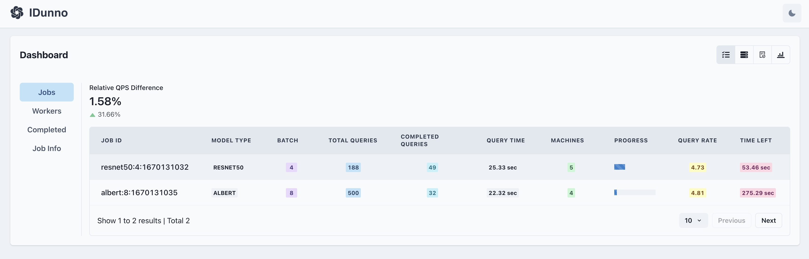
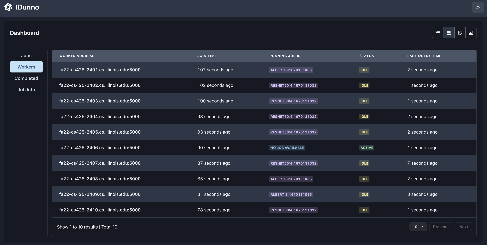
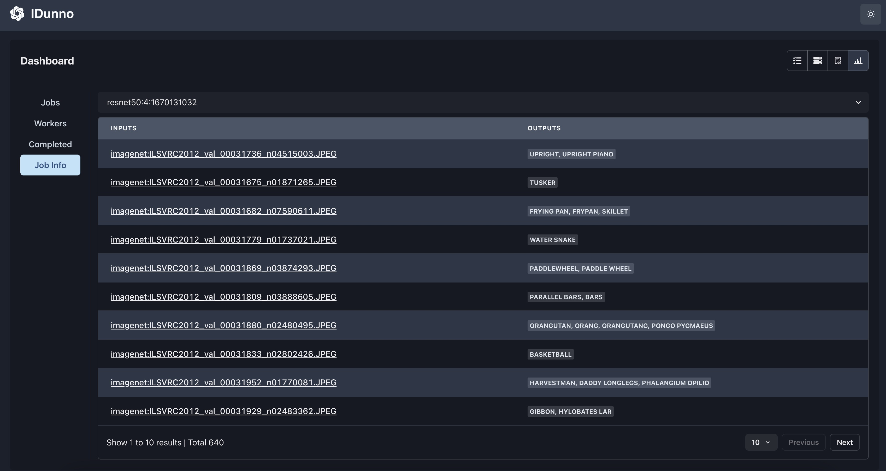
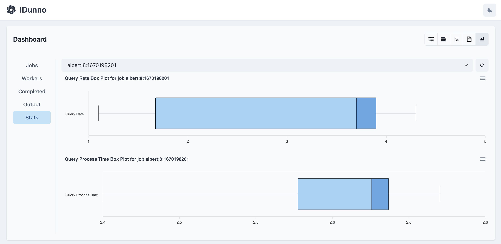

# IDunno - Fault-tolerent Distributed ML Cluster

<div>

</div>

## Architecture Overview


## Python Environment Setup

In root folder `mp4`, run

```bash
python3 -m venv .env

source .env/bin/activate

.env/Scripts/activate

pip install -r requirement.txt
```

Test installation

```bash
python -c "from transformers import pipeline; print(pipeline('sentiment-analysis')('we love you'))"
```

Expected output:

```bash
[{'label': 'POSITIVE', 'score': 0.9998704791069031}]
```

## Go Environment Setup

To compile the project, you need to have Golang installed on your machine. You can download Golang from [here](https://golang.org/dl/). Once you have Golang installed, you need to download dependency `gRPC` and `Protobuf`. You can do this by running the following command in your terminal:

```
go get -u google.golang.org/grpc
go get -u github.com/golang/protobuf/protoc-gen-go
```

After you have all the dependencies installed, you can compile the project by running the following command in your terminal:

```
make all
```

This will generate the executable files in the `bin` folder.

## Start Running Server

You can run the executable file by running the following command in your terminal:

### Start DNS Server

```
cd bin
./dns
```

### Start IDunno Inference Engine

```
cd bin
./idunno
```

> **IDunno** server automatically starts python gRPC server for inference.

## How to Use
You need to run only one `dns` executable file. You can run multiple `idunno` executable files. Each `idunno` executable file will be a host server.
Here is a list of commands you can use in the `idunno` executable file:

```
join            # Join the ring
leave           # Leave the ring
list_mem        # List all members in the ring
clear           # clear all content from log file
stat            # print statistics of Bps read/write, #pings, #failures, system elapsed time
low_droprate    # Set the drop rate to low (0.03)
mid_droprate    # Set the drop rate to medium (0.3)
high_droprate   # Set the drop rate to high (0.9)
```

Here are more commands for the SDFS:

```
get <sdfsfilename> <local_filename>                         # Get a file from the SDFS
put <local_filename> <sdfsfilename>                         # Put a local file to the SDFS
putdir <local_directory> <sdfs_directory>                   # Put a local directory with all files inside to the SDFS
delete <sdfsfilename>                                       # Delete a file from the SDFS
deldir <sdfs_directory>                                     # Delete a directory with all files inside from the SDFS
ls <sdfsfilename>                                           # List the servers storing the file
store                                                       # List all files stored in the current server
get-versions <sdfsfilename> <num versions> <localfilename>  # Retrieve the last num versions of the file
```

Here are more commands for the IDunno Learning Cluster:
```
train <model> <dataset>     # train a model on specified dataset
serve <model> <batch_size>  # start inference on model with a batch size
w                           # display all workers
j                           # display all running jobs & their current states
ij <job_id>                 # display a particular job's current inference output and accuracy
cj                          # display all completed jobs
ijs <job_id>                # displat a particular job's query rate and query processing time statistics
qps [global|local]          # change scheduling mode to be local or global
```

## Configure Frontend UI Dashboard
To provide a better user experience in viewing real-time updates of IDunno system, we built a frontend dashboard using `React` and `TypeScript`. Here are steps to start frontend dashboard:

### Start HTTP backend server
Backend server automatically starts after executing `./dns`. 

## Start Frontend UI
Go to `./frontend`. Run

```
pnpm install
pnpm run dev
```

### Screenshots of Dashboard UI




